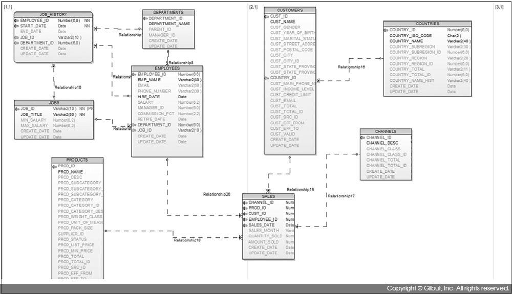
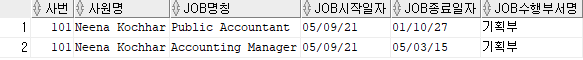
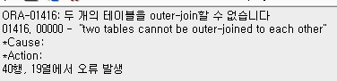

# Chapter_Self_Check

[6장 테이블 사이를 연결해 주는 조인과 서브 쿼리 알아 보기](https://thebook.io/006696/part01/ch06/)



```sql
DESC employees;  -- employee_id, emp_name, email, phone_number, hire_date, salary, manager_id, department_id, 
DESC departments; -- department_id, department_name, parent_id, manager_id, create_date, update_date
DESC job_history;  -- employee_id, start_date, end_date, job_id, department_id, create_date, update_date
DESC jobs; -- job_id, job_title, min_salary, max_salary, ...
```

# CHAPTER_6. 테이블 사이를 연결해 주는 조인과 서브 쿼리 알아보기

## 1. 101번 사원에 대해 아래의 결과를 산출하는 쿼리를 작성해보자.

—  사번 사원명 job명칭 job시작일자 job종료일자 job수행부서명  —

```sql
-- 입력
-- 101번 사원 조회 

SELECT 
    a.employee_id as 사번
    , a.emp_name as 사원명
    , d.job_title as job명칭
    , a.hire_date as job시작일자
    , c.end_date as job종료일자
    , b.department_name as job수행부서명
FROM 
    employees a
    , departments b
    , job_history c
    , jobs d
WHERE 
    a.employee_id = c.employee_id
    AND a.department_id = b.department_id
    AND c.job_id = d.job_id
    AND a.employee_id = 101;

-- 결과

```

- 정답 :



## 2. 아래의 쿼리를 수행하면 오류가 발생한다. 오류의 원인은 무엇인지 설명해 보자.

```sql
-- 입력

SELECT
    a.employee_id
    , a.emp_name
    , b.job_id
    , b.department_id
FROM 
    employees a
    , job_history b
WHERE 
    a.employee_id = b.employee_id(+)
    and a.department_id(+) = b.department_id;

-- 결과
```



- ORA-01416 : 두 개의 테이블을 outer-join할 수 없습니다. 라는 오류구문이 발생.
- 동등 조인(EQUI-JOIN) : 동등 조인은 WHERE절에서 등호(’=’)연산자를 사용해 2개 이상의 테이블이나 뷰를 연결한 조인이다. 즉 등호 연산자를 사용한 WHERE절 조건에 만족하는 데이터를 추출하는 조인이다. 이때 WHERE절에 기술한 조건을 조인 조건이라고 한다.
- 조인 조건은 컬럼 단위로 기술한다. 예를 들어, A와 B 테이블이 있다고 한다면 두 테이블에서 공통된 값을 가진 컬럼을 등호 연산자로 연결해 조인 조건에 일치하는, 즉 조인 조건 결과가 참(TRUE)에 해당하는, 다시 말해 두 컬럼 값이 같은 행을 추출하는 것이다.
- 외부조인(OUTER-JOIN) : 외부조인은 일반 조인을 확장한 개념으로, 조인 조건에 만족하는 데이터 뿐만 아니라, 어느 한 쪽 테이블에 조인 조건에 명시된 컬럼에 값이 없거나(NULL 이더라도) 해당 로우가 아예 없더라도 데이터를 모두 추출한다.
- 외부 조인 시 알아야 할 내용 :
    - 조인 대상 테이블 중 데이터가 없는 테이블 조인 조건에 (+)를 붙인다.
    - 외부 조인의 조인 조건이 여러 개일 때 모든 조건에 (+)를 붙인다.
    - 한 번에 한 테이블에만 외부 조인을 할 수 있다. 예를 들어, 조인 대상 테이블이 A, B, C 3개이고, A를 기준으로 B테이블을 외부 조인으로 연결 했다면, 동시에 C를 기준으로 B테이블에 외부 조인을 걸 수는 없다.
    - (+) 연산자가 붙은 조건과 OR를 같이 사용할 수 없다.
    - (+) 연산자가 붙은 조건에는 IN 연산자를 같이 사용할 수 없다. (단 IN절에 포함되는 값이 1개인 때는 사용가능)
- 정답 :

```sql
 AND a.department_id(+) = b.department_id; -- 오답
 AND a.department_id = b.department_id(+); -- 정답
```

## 3. 외부조인시 (+)연산자를 같이 사용할 수 없는데, IN절에 사용하는 값이 1개인 경우는 사용 가능하다. 그 이유는 무엇일까?

- 세미 조인(SEMI-JOIN) : 세미 조인은 서브 쿼리를 사용해 서브 쿼리에 존재하는 데이터만 메인 쿼리에서 추출하는 조인 방법으로 IN과 EXISTS 연산자를 사용하는 조인이다. 서브 쿼리에 있는 테이블을 B, 메인 쿼리에 사용된 테이블을 A라고 한다면 세미 조인은 B 테이블에 존재하는 A 테이블의 데이터를 추출하는 조인이다.
- IN 연산자는 OR 조건으로 변환할 수 있는데, 즉 “이것이거나 저것이거나” 로 풀어쓸 수 있다. 세미 조인은 서브쿼리에 존재하는 메인 쿼리 데이터가 여러 건 존재하더라도 최종 반환되는 메인 쿼리 데이터에는 중복되는 건이 없다는 점이 일반 조인과의 차이점이다. 반면 일반 조인을 하면 SELECT 절에는 B 테이블 컬럼을 전혀 명시하지 않더라도 중복되는 건이 발생 한다.
- 정답 :

```sql
오라클은 IN 절에 포함된 값을 기준으로 OR로 변환한다.
예를 들어, 
   department_id IN (10, 20, 30) 은
   department_id = 10
   OR department_id = 20
   OR department_id = 30) 로 바꿔 쓸 수 있다.
   
그런데 IN절에 값이 1개인 경우, 즉 department_id IN (10)일 경우 department_id = 10 로 
변환할 수 있으므로, 외부조인을 하더라도 값이 1개인 경우는 사용할 수 있다.
```

- 사실 잘 모르겠다. 예를 들어봐도 오류만 뜬다.

## 4. 다음의 쿼리를 ANSI 문법으로 변경해 보자.

```sql
-- 기존 문법

SELECT
    a.department_id
    , a.department_name
    
FROM 
    departments a
    , employees b
    
WHERE 
     a.department_id = b.department_id -- 조인 조건 
     AND b.salary > 3000

ORDER BY a.department_name;
```

- 정답 :

```sql
-- ANSI 문법

SELECT
    a.department_id
    , a.department_name
    
FROM 
    departments a
    INNER JOIN employees b
    ON ( a.department_id = b.department_id) -- 조인 조건

WHERE 
    b.salary > 3000
    
ORDER BY a.department_name;
```

## 5. 다음은 연관성 있는 서브 쿼리다. 이를 연관성 없는 서브 쿼리로 변환해 보자.

```sql
-- 입력

SELECT 
    a.department_id
    , a.department_name
FROM 
    departments a
WHERE EXISTS ( SELECT 1
                FROM job_history b
                WHERE a.department_id = b.department_id ); -- 조인 조건
```

- 연관성 있는 서브 쿼리 : 메인쿼리와의 연관성이 잇는 서브 쿼리, 즉 메인 테이블과 조인 조건이 걸린 서브 쿼리를 말한다.
- 이 쿼리는 연관성 있는 서브 쿼리로 서브 쿼리 안에서 메인 쿼리에서 사용된 부서 테이블의 부서 번호와 job_history 테이블의 부서번호가 같은 건을 조회하고 있다.  또한 EXISTS 연산자를 사용해서 서브 쿼리 내에 조인 조건이 포함되어 있다.
- 연관성 없는 서브 쿼리 : 메인 쿼리와 연관성이 없는 서브 쿼리를 말한다. 즉 메인 테이블과 조인 조건이 걸리지 않는 서브 쿼리를 가리킨다.
- 즉, 조인 조건을 제거하고 출력값이 같게 나오도록 하는 것이 정답이다.
- 정답 :

```sql
SELECT 
	a.department_id
	, a.department_name
 FROM 
	departments a
WHERE a.department_id IN ( SELECT department_id
                             FROM job_history  );
```

## 6. 연도별 이탈리아 최대매출액과 사원을 작성하는 쿼리를 학습했다. 이 쿼리를 기준으로 최대매출액 뿐만 아니라 최소매출액과 해당 사원을 조회하는 쿼리를 작성해 보자.

```sql
SELECT 
    emp.years 
    , emp.employee_id
    , emp2.emp_name
    , emp.amount_sold

FROM 
    ( SELECT 
        SUBSTR(a.sales_month, 1, 4) as years
        , a.employee_id
        , SUM(a.amount_sold) AS amount_sold
        FROM 
            sales a
            , customers b
            , countries c
        WHERE 
            a.cust_id = b.cust_id
            AND b.country_id = c.COUNTRY_ID
            AND c.country_name = 'Italy'     
        GROUP BY 
            SUBSTR(a.sales_month, 1, 4)
            , a.employee_id   
        ) emp,
       ( SELECT  
            years 
            , MAX(amount_sold) AS max_sold
            , MIN(amount_sold) AS min_sold
          FROM ( SELECT 
                    SUBSTR(a.sales_month, 1, 4) as years
                    , a.employee_id 
                    , SUM(a.amount_sold) AS amount_sold
                   FROM sales a
                        , customers b
                        , countries c
                  WHERE a.cust_id = b.CUST_ID
                    AND b.country_id = c.COUNTRY_ID
                    AND c.country_name = 'Italy'     
                  GROUP BY 
                    SUBSTR(a.sales_month, 1, 4)
                    , a.employee_id    
               ) K
          GROUP BY years
       ) sale
        , employees emp2
WHERE emp.years = sale.years
   AND (emp.amount_sold = sale.max_sold  OR emp.amount_sold = sale.min_sold)
   AND emp.employee_id = emp2.employee_id
  
ORDER BY years;
```

- 출력 항목 : 연도, 사원번호, 사원이름, 매출액
- 필요한 테이블 :
    - 이탈리아 찾기 : countries
    - 이탈리아 고객 찾기 : customers
    - 매출 : sales
    - 사원정보 : employees
- 단위 분할
    - 연도, 사원별 이탈리아 매출액 구하기
        - 이탈리아 고객 찾기 : customers, countries를 country_id로 조인, country_name이 ‘Italy’인 것 찾기
        - 이탈리아 매출 찾기 : 위 결과와 sales 테이블을 cust_id로 조인
        - 최대 최소 매출액을 구하려면 MAX, MIN 함수를 쓰고, 연도별로 GROUP BY 필요.
1. 연도, 사원별 이탈리아 매출액 구하기

```sql
-- 1. 연도, 사원별 이탈리아 매출액 구하기

SELECT 
    SUBSTR(a.sales_month, 1, 4) as years
    , a.employee_id 
    , SUM(a.amount_sold) AS amount_sold
    
FROM 
    sales a
    , customers b
    , countries c
                  
WHERE 
    a.cust_id = b.CUST_ID
    AND b.country_id = c.COUNTRY_ID
    AND c.country_name = 'Italy'     
                  
GROUP BY 
    SUBSTR(a.sales_month, 1, 4)
    , a.employee_id
```

1. 1. 에서 구한 결과에서 연도별 최대, 최소 매출액 구하기

```sql
-- 2. 1.에서 구한 결과에서 연도별 최대, 최소 매출액 구하기

SELECT  
    years 
    , MAX(amount_sold) AS max_sold
    , MIN(amount_sold) AS min_sold
    
FROM ( SELECT 
            SUBSTR(a.sales_month, 1, 4) as years
            , a.employee_id 
            , SUM(a.amount_sold) AS amount_sold
            
        FROM 
            sales a
            , customers b
            , countries c
            
        WHERE 
            a.cust_id = b.CUST_ID
            AND b.country_id = c.COUNTRY_ID
            AND c.country_name = 'Italy' 
            
        GROUP BY 
            SUBSTR(a.sales_month, 1, 4)
            , a.employee_id    
        ) K
        
GROUP BY years
ORDER BY years;
```